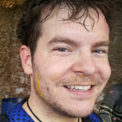
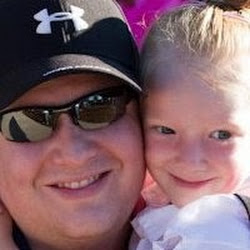
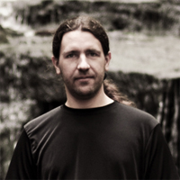
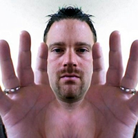
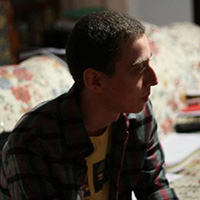
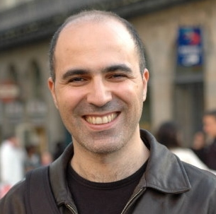
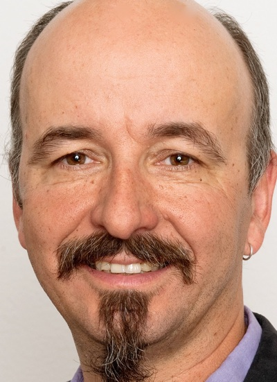

Title: Community Faces

<!-- Standard Structure -->

<h4>Community Faces</h4>

Apache Flex® is updated and maintained by a large group of individuals, including you.  Your contributions, whether just using Flex, or reporting bugs or proposing patches to code and documentation are a welcome part of making Flex better.  Certain individuals can earn committer rights and eventually earn membership in the Project Management Committee.  Here are some of the committers and PMC members.  Find them on the mailing lists and elsewhere talking about Flex.  If you are looking for support, please contact us on the <a href="/community-mailinglists.html">mailing lists</a> or open a ticket in our bug tracking system (<a href="https://issues.apache.org/jira/browse/FLEX">JIRA</a>).

<h4>Contribute to Apache Flex®!</h4>

<!-- Large Notice -->

<h2>We need you!</h2>

Apache Flex® is a project run by volunteers.  If you would like to help the project including contributing code, documentation, training or marketing, we are always looking for help.

<a href="community-getinvolved.html" class="btn btn-inverse">Find out more</a>

<!-- Standard Structure End -->

<h4>Apache Flex Committers</h4>

<!-- About -->

<h5>Alex Harui</h5> PMC Chair of Apache Flex<i class="icon-tag"></i> aharui (C+P)

Alex Harui has been working on the Flex SDK since he joined Macromedia in 2002.  He is now spending most of 
his time on a next-generation of Flex called FlexJS that cross-compiles MXML and ActionScript into JavaScript so your Flex apps can 
run without Flash and AIR.

<!-- Social Icons -->
<ul class="social-icons">
</ul>

<!-- About -->

<h5>Carlos Rovira</h5> <i class="icon-tag"></i><a href="#carlosrovira">carlosrovira (C)</a>

Carlos Rovira is a technologist, entrepreneur and businessman. He is passionate about advanced web interfaces and rich multi-device business applications. He is extremely happy when their applications are useful for people, combining functionality and usability. He's founder of various companies including carlosrovira.com in 2007 and <a href="http://www.codeoscopic.com">Codeoscopic</a> in 2009. He's the technical leader behind the <a href="http://www.codeoscopic.com/tecnologia/riality/">Riality</a> Flex/JEE Platform and other successful insurance software products like <a href="http://www.directwriter.es">Direct Writer</a> and <a href="http://www.avant2.es">Avant 2</a>.

<!-- Social Icons -->
<ul class="social-icons">
<li class="twitter"><a href="https://www.twitter.com/carlosrovira">Twitter</a></li>
<li class="github"><a href="https://www.github.com/carlosrovira">Github</a></li>
<li class="linkedin"><a href="https://es.linkedin.com/in/carlosrovira/">LinkedIn</a></li>
<li class="googleplus"><a href="https://plus.google.com/115670167046758349523">Google Plus</a></li>
<li class="rss"><a href="https://www.carlosrovira.com/blog/feed/">RSS</a></li>
</ul>

<!-- About -->

<h5>Carol Frampton</h5> <i class="icon-tag"></i>cframpton (C+P)

Carol is a software engineer at Adobe, based outside of Boston.  She worked on Adobe Flex for about five years - FTE and TLF text with Gordon, Spark DataGrid, mirroring and the top bug fixer for the last couple of years - then transitioned with Flex to Apache. Release manager for Apache Flex 4.8.0.  Being a generalist, she's worked on a wide variety of software, including ColdFusion and JRun, kernel-level networking code and distributed networking software. 

<!-- Social Icons -->
<ul class="social-icons">
<li class="linkedin"><a href="https://www.linkedin.com/in/carolframpton">LinkedIn</a></li>
</ul>

<!-- About -->

<h5>Chema Balsas</h5> <i class="icon-tag"></i> jbalsas (C)

Web application developer. Focusing on JS right now and trying to help with Falcon and FalconJS as an Apache Flex Commiter.

<!-- Social Icons -->
<ul class="social-icons">
<li class="twitter"><a href="https://www.twitter.com/jbalsas">Twitter</a></li>
<li class="github"><a href="https://www.github.com/jbalsas">Github</a></li>
<li class="linkedin"><a href="https://www.linkedin.com/in/jbalsas">LinkedIn</a></li>
<li class="googleplus"><a href="https://plus.google.com/109872083963647761639">Google Plus</a></li>
</ul>

<!-- end of the row -->

<!-- About -->

<h5>Christofer Dutz</h5> <i class="icon-tag"></i>cdutz (C+P)

Christofer is a software engineer secialized on Flex, Java, Spring and Maven. He is the lead developer of the <a href="https://flexmojos.atlassian.net/wiki/display/FLEXMOJOS/Home" target="_blank">Flexmojos</a> project (Maven plugin for building Flex applications) after taking over from Velo in 2012. His main areas of contribution to the Apache Flex project is creating a tool for creating Mavenized versions of Flex SDKs, continuing to advance Flex' Maven support.

<!-- Social Icons -->
<ul class="social-icons">
<li class="twitter"><a href="https://de.twitter.com/ChristoferDutz">Twitter</a></li>
<li class="github"><a href="https://github.com/chrisdutz">Github</a></li>
<li class="linkedin"><a href="https://www.linkedin.com/pub/christofer-dutz/49/9b6/424">LinkedIn</a></li>
</ul>

<!-- About chrsmrtn -->

<h5>Chris Martin</h5> <i class="icon-tag"></i><a href="#chrsmrtn">chrsmrtn (C+P)</a>

Chris has been doing Flex UI development since Flex 2 and is very excited to be apart of the Apache Flex Team. With the Apache Flex Team, he feels that the Flex SDK has a bright future. He looks to help with the flex sdk bug verification and patching.

 <!-- Social Icons -->
<ul class="social-icons">
<li class="twitter"><a href="https://www.twitter.com/chrsmrtn">Twitter</a></li>
<li class="github"><a href="https://www.github.com/chrsmrtn-">Github</a></li>
<li class="linkedin"><a href="https://es.linkedin.com/in/chrsmrtn/">LinkedIn</a></li>
<li class="googleplus"><a href="https://plus.google.com/+chrismartinplus">Google Plus</a></li>
<li class="wordpress"><a href="https://chrsmrtn.azurewebsites.net">Blog</a></li>
</ul>

<!-- About DarkStone -->

<h5>DarkStone (周戈)</h5> <i class="icon-tag"></i> darkstone (C)

DarkStone has been doing Flash since 2002, doing Flex since 2006, doing PHP since 2007, he is both a designer and a developer.
  He had several jobs, last job he was a product manager for 3 years, had done several RIA products.

Since 2013 he quit his job and started his own studio, forging his own path.
  Now he's goal is to develop mobile and desktop platform apps (using Flex and PHP etc.) and sell them to the AppStore.
  Basically, make the money first, and try to change the world later ; )

He is now living in Wuhan city of China.

<!-- Social Icons -->
<ul class="social-icons">
</ul>

<!-- About -->

<h5>Douglas Arthur</h5> <i class="icon-tag"></i> dougarthur (C+P)

Douglas passed away in May, 2012.  He is deeply missed within our community.

<!-- Social Icons -->
<ul class="social-icons">
</ul>

<!-- end of the row -->

<!-- About -->

<h5>Erik de Bruin</h5> <i class="icon-tag"></i> erikdebruin (C+P)

Erik is a software engineer (Flex/Flash, PHP, Delphi, Authorware, to name a few), e-learning consultant and occassional project manager. For the Apache Flex project he is a committer and part of the PMC. He has contributed the SDK Installer Badge, was contributor and co-release manager on the first release of the SDK Installer and is currently busy getting the FalconJx and FlexJS projects off the ground.

<!-- Social Icons -->
<ul class="social-icons">
<li class="linkedin"><a href="https://www.linkedin.com/pub/erik-de-bruin/1/281/176">LinkedIn</a></li>
</ul>

<!-- About -->

<h5>Espen Skogen</h5> <i class="icon-tag"></i> espenskogen (C+P)

Espen is a Vice President at JP Morgan, where he is leading the development of client facing trading technology. Espen was one of the initial committers and PMC members of Apache Flex. 

<!-- Social Icons -->
<ul class="social-icons">
<li class="linkedin"><a href="https://uk.linkedin.com/in/espenskogen">LinkedIn</a></li>
</ul>

<!-- About -->

<h5>Frédéric Thomas</h5> <i class="icon-tag"></i> fthomas (C+P)

Freelancer, software architect, Apache Flex PMC Member, trying to make the Flex world better. (French)

<!-- Social Icons -->
<ul class="social-icons">
<li class="twitter"><a href="https://www.twitter.com/webdoublefx">Twitter</a></li>
<li class="googleplus"><a href="https://plus.google.com/116545614452242070442/posts">Google Plus</a></li>
</ul>

<!-- About -->

<h5>Gordon Smith</h5> <i class="icon-tag"></i> gordonsmith (C+P)

Gordon is currently working on completing MXML support in the new Falcon compiler.
He lives in San Francisco and works for Adobe.

Gordon was one of the original four engineers on a 2002 Macromedia project that became Flex,
and worked on the Flex framework for eight years:
<ul>
<li>Developed components for Flex 1.0.</li>
<li>Built a customer application with Flex 1.5.</li>
<li>Led the port to AS3 for Flex 2.</li>
<li>Designed and implemented the ResourceManager for Flex 3.</li>
<li>Integrated the FTE and TLF text technologies into Flex 4.</li>
</ul>

Since 2010 he has been part of the compiler team at Adobe.

<!-- Social Icons -->
<ul class="social-icons">
</ul>

<!-- end of the row -->

<!-- About -->

<h5>Harbs</h5> <i class="icon-tag"></i> harbs (C+P)

Harbs comes from a print background and his primary interest is in publishing. He keeps himself busy with his multiple technology businesses: 
<a href="https://in-tools.com">In-Tools</a>, <a href="https://printui.com">PrintUI</a> and <a href="https://unhurdle.com/">UnHurdle</a>. 
All three businesses rely heavily on Flex as one of the active technologies, so Harbs has a strong interest in Flex.
  
Harbs also spends his time studying Talmud, and with his wife and kids. If there's any time left, he gets a bit of sleep.

<!-- Social Icons -->
<ul class="social-icons">
<li class="facebook"><a href="https://www.facebook.com/gharbs">Facebook</a></li>
<li class="linkedin"><a href="https://www.linkedin.com/profile/view?id=46698545">LinkedIn</a></li>
<li class="github"><a href="https://github.com/Harbs">GitHub</a></li>
<li class="twitter"><a href="https://www.twitter.com/intools">Twitter</a></li>
</ul>

<!-- About -->

<h5>Jeffry Houser</h5> <i class="icon-tag"></i> jhouser (C+P)

<a href="https://www.jeffryhouser.com">Jeffry Houser</a> is a technical entrepreneur that likes to share cool stuff with other people. 
Jeffry is the Brains behind <a href="https://www.flextras.com">Flextras</a>, a library of Open Source Flex Components 
including a Calendar, AutoComplete, and a Mobile DropDownList.  
  
Jeffry is one of the initial contributors to Apache Flex and his primary interest lies in  
expanding the component library, especially for use in mobile applications.  
  
In his spare time, Jeffry runs <a href="https://www.dot-com-it.com.">DotComIt</a>, a consulting firm developing Rich Internet Applications. He has spoken 
all over the US, is author of three books, over 30 articles, and hundreds of podcasts.

<!-- Social Icons -->
<ul class="social-icons">
<li class="facebook"><a href="https://www.facebook.com/reboog711">Facebook</a></li>
<li class="linkedin"><a href="https://www.linkedin.com/in/jeffryhouser">LinkedIn</a></li>
<li class="github"><a href="https://github.com/Flextras/FlextrasComponents/">GitHub</a></li>
<li class="rss"><a href="https://www.jeffryhouser.com/rss.cfm?mode=full">RSS</a></li>
<li class="rss"><a href="https://www.flextras.com/blog/rss.cfm?mode=full">RSS</a></li>
<li class="twitter"><a href="https://www.twitter.com/reboog711">Twitter</a></li>
</ul>

<!-- About -->

<h5>Jeremy Tellier</h5> <i class="icon-tag"></i> jtellier (C+P)

Macromedia/Adobe Technology evangelist, architect, engineer, Jeremy has implemented a slew of Flash, Flex, & AIR based solutions for startups to fortune 100 companies over the past 15 years.
  
Jeremy works as a consultant at <a href="https://www.actieve.com" target="_blank">Actieve</a> for Rich Mobile, Desktop & Web Based projects in which Flex is at the top of his preferred technology stack.
  
On a more personal note.... Jeremy feels awkward writing about himself in the third person.

<!-- Social Icons -->
<ul class="social-icons">
	<li class="facebook"><a href="https://www.facebook.com/JeremyTellier">Facebook</a></li>
	<li class="linkedin"><a href="https://www.linkedin.com/in/jeremytellier/">LinkedIn</a></li>
	<li class="googleplus"><a href="https://plus.google.com/115560858703396246574">Google+</a></li>
	<li class="twitter"><a href="https://www.twitter.com/jtellier">Skype</a></li>
	<li class="skype"><a href="skype:JeremyTellier?chat">Skype</a></li>
</ul>

<!-- About -->

<h5>Jose Barragan</h5> <i class="icon-tag"></i><a href="#josebarragan">josebarragan (C)</a>

Jose Barragan is a Software Architect, with over 10 years experience in the enterprise sector. Has a big experience in design, development and implementation of high performance software in corporate environments. Has an extensive knowledge of Flex, Java, Spring, Hibernate, Maven, Git, being the technical co-leader behind the <a href="https://www.codeoscopic.com/tecnologia/riality/">Riality</a> Flex/JEE Platform and other successful insurance software products like <a href="https://www.directwriter.es">Direct Writer</a> and <a href="https://www.avant2.es">Avant 2</a>. Restless mind and enthusiast of new technologies. Always learning from everything and everyone.

<!-- Social Icons -->
<ul class="social-icons">
<li class="twitter"><a href="https://www.twitter.com/morphx">Twitter</a></li>
<li class="github"><a href="https://github.com/pepebarragan">Github</a></li>
<li class="linkedin"><a href="https://es.linkedin.com/in/pepebarragan/">LinkedIn</a></li>
</ul>

<!--end of the row-->

<!-- About JosephLabrecque -->

    
    

        <h5>Joseph Labrecque</h5> 
        <i class="icon-tag"></i>josephlabrecque (C)
    

    

        
Joseph Labrecque is primarily employed by the University of Denver as a senior interactive software engineer specializing in the creation of expressive desktop, web, and mobile solutions. He is also the proprietor of Fractured Vision Media, LLC. Joseph is an Adobe Education Leader and Adobe Community Professional.

    

    <!-- Social Icons -->
    <ul class="social-icons">
        <li class="twitter"><a href="https://twitter.com/josephlabrecque">Twitter</a></li>
        <li class="linkedin"><a href="https://www.linkedin.com/in/josephlabrecque">LinkedIn</a></li>
        <li class="rss"><a href="https://www.lynda.com/JosephLabrecque">Lynda.com</a></li>
        <li class="amazon"><a href="https://www.amazon.com/-/e/B0057R7UO0">Amazon</a></li>
        <li class="behance"><a href="https://www.behance.net/JosephLabrecque">Behance</a></li>
        <li class="facebook"><a href="https://www.facebook.com/joseph.labrecque">Facebook</a></li>
        <li class="googleplus"><a href="https://google.com/+JosephLabrecque/">Google+</a></li>
        <li class="github"><a href="https://github.com/josephlabrecque/">Github</a></li>
        <li class="youtube"><a href="https://www.youtube.com/channel/UCOznZ0dg3BwfhxwO2p90ejQ">YouTube</a></li>
        <li class="rss"><a href="https://inflagrantedelicto.memoryspiral.com/feed/">In Flagrante Delicto!</a></li>
    </ul>

<!-- About joshtynjala -->

    
    

        <h5>Josh Tynjala</h5> 
        <i class="icon-tag"></i>joshtynjala (C+P)
    

    

        
<a href="https://twitter.com/joshtynjala">Josh Tynjala</a> is the author of the open source <a href="https://feathersui.com/">Feathers</a> user interface components for Starling Framework. In addition to improving the Apache FlexJS compilers, Josh teaches developers how to transpile ActionScript on his website, <a href="https://nextgenactionscript.com/">NextGen ActionScript</a>.

    

    <!-- Social Icons -->
    <ul class="social-icons">
        <li class="twitter"><a href="https://twitter.com/joshtynjala">Twitter</a></li>
        <li class="github"><a href="https://github.com/joshtynjala">Github</a></li>
    </ul>

<!-- About junheider -->

<h5>Jun Heider</h5> 
<i class="icon-tag"></i>junheider (C+P)

Helping Apache Flex grow through mentoring and community awareness. An officer of the Open Spoon Foundation. Cross-platform Flex mobile developer at RealEyes Media with a focus in video and multiuser applications. Adjunct Faculty at University of Denver, University College teaching students how to build native applications with Adobe AIR.

<!-- Social Icons -->
<ul class="social-icons">
<li class="twitter"><a href="https://twitter.com/coderjun">Twitter</a></li>
<li class="linkedin"><a href="https://www.linkedin.com/in/junheider">LinkedIn</a></li>
</ul>

<!-- About jmclean -->

<h5>Justin Mclean</h5> <i class="icon-tag"></i> jmclean (C+P)

Experienced web application developer, certified trainer, international conference speaker and Arduino tinkerer. Interesting in making Apache Flex more international and work on a wider range of platforms. Added international postcode support and locales to Apache Flex 4.9.0. Release manager for Apache Flex 4.9.0.

<!-- Social Icons -->
<ul class="social-icons">
<li class="twitter"><a href="https://twitter.com/JustinMclean">Twitter</a></li>
<li class="linkedin"><a href="https://www.linkedin.com/in/justinmclean">LinkedIn</a></li>
<li class="github"><a href="https://www.github.com/justinmclean">GitHub</a></li>
</ul>

<!--end of the row-->

<!-- About akamud -->

 

 
 
<h5>Mahmoud Ali</h5> <i class="icon-tag"></i> akamud (C)

 

  
.NET and Apache Flex developer, working on Web and mobile applications. One of the creators of the <a href="https://github.com/akamud/FlatSpark">FlatSpark</a> skin, a project to bring a more clean and modern look to Apache Flex applications, recently donated to Apache Software Foundation. His goal as a committer is to continue improving and creating new Skins and components for Flex.

  
Always interested in learning and sharing about new technologies. In his spare time wanders around the internet looking for open source projects that need help. 
    Also feels weird describing himself in the third person.

 

 <!-- Social Icons -->
 <ul class="social-icons">
  <li class="linkedin"><a href="https://www.linkedin.com/in/akamud/en">LinkedIn</a></li>
  <li class="github"><a href="https://github.com/akamud">GitHub</a></li>
  <li class="twitter"><a href="https://twitter.com/akamud">Twitter</a></li>
  <li class="wordpress"><a href="https://www.akamud.com.br/">Blog</a></li>
  <li class="rss"><a href="https://www.akamud.com.br/feed">RSS</a></li>
 </ul>

 <!-- About mamsellem -->

 

 
 
<h5>Maurice Amsellem</h5> <i class="icon-tag"></i> mamsellem (C+P)

 

  
Maurice has been working for <a href="https://www.systar.com">Systar</a> since 1996 in various positions, 
  and since 2009 as a software engineer on a Flex-based BAM application development framework.

  
Maurice is professionally interested in GUI design in general, and personally in clay modeling. 
  He is based in Paris area, France.

 

 <!-- Social Icons -->
 <ul class="social-icons">
  <li class="linkedin"><a href="https://www.linkedin.com/pub/maurice-amsellem/1/50a/b64">LinkedIn</a></li>
 </ul>

<!-- About -->

<h5>Michael Schmalle</h5> <i class="icon-tag"></i> mschmalle (C+P)

Past; ActionScript since 2001 and ui component developer. Created a read/write DOM for ActionScript in AS3 and Java, familiar with parsers and compilers.
  Future; Working creating a framework to make synths and sequencers for techno music in Android and also Unity3D, WebAudio and JavaScript.
  Leading the development of FalconJx to finally put the last nail in the Flash Player for myself.
I don't claim to be anything I'm not, the thrid person scares me.

<!-- Social Icons -->
<ul class="social-icons">
<li class="github"><a href="https://github.com/teotigraphix">GitHub</a></li>
<li class="linkedin"><a href="https://www.linkedin.com/pub/michael-schmalle/4/409/980/">LinkedIn</a></li>
<li class="rss"><a href="https://blog.teotigraphix.com/feed">RSS</a></li>
<li class="twitter"><a href="https://www.twitter.com/teotigraphix">Twitter</a></li>
</ul>

<!-- About -->

<h5>Nicholas Kwiatkowski</h5> <i class="icon-tag"></i> quetwo (C+P)

Working on components, website, marketing.

<!-- Social Icons -->
<ul class="social-icons">
<li class="facebook"><a href="https://www.facebook.com/quetwo">Facebook</a></li>
<li class="twitter"><a href="https://www.twitter.com/quetwo">Twitter</a></li>
<li class="blogger"><a href="https://www.quetwo.com">Blogger</a></li>
<li class="googleplus"><a href="https://plus.google.com/106376488955804514674/">Google Plus</a></li>
<li class="deviantart"><a href="https://quetwo.deviantart.com">DeviantART</a> </li>
</ul>

<!-- end of the row -->

<!-- About -->

<h5>Omar Gonzalez</h5> <i class="icon-tag"></i> s9tpepper (C+P)

Apache Flex committer and PMC member. Test driven development enthusiast. Wrestles code all day. Developing Flash since 2000, Flex since version 2 beta. Senior Architect for <a href="https://almerblank.com" target="_blank">almer/blank</a> developing front-ends and back-ends in HTML5, JavaScript, Flash, Flex, Node.js, PHP, MySQL and MongoDB, just to name a few. Interested in expanding Apache Flex beyond the Flash Player plugin as well as other random experiments.

<!-- Social Icons -->
<ul class="social-icons">
<li class="twitter"><a href="https://www.twitter.com/s9tpepper">Twitter</a></li>
<li class="github"><a href="https://github.com/s9tpepper">GitHub</a></li>
<li class="rss"><a href="https://omar.gy/rss">RSS</a></li>
<li class="googleplus"><a href="https://plus.google.com/109288512951904372418">Google Plus</a></li>
</ul>

<!-- About -->

<h5>OmPrakash Muppirala</h5> <i class="icon-tag"></i> bigosmallm (C + P)

Om 'bigosmallm' Muppirala is a UI architect with years of experience building Flex and Flash based applications. He has been working on various tools and utilities aimed at making life easier for Apache Flex developers and users(SDK Installer, OneClick Mustella, etc.)  Also interested in contributing more web and mobile Flex components.

<!-- Social Icons -->
<ul class="social-icons">
<li class="twitter"><a href="https://twitter.com/bigosmallm">Twitter</a></li>
<li class="linkedin"><a href="https://www.linkedin.com/in/omprakashm/">LinkedIn</a></li>
</ul>

<!-- About peterelst -->

<h5>Peter Elst</h5> <i class="icon-tag"></i> peterelst (C + P)

Peter is a Web Solutions Engineer at Google, an author of multiple ActionScript books, speaker at various industry events and longtime supporter of Flex as a platform.

In his spare time, you can find him blogging at <a href="https://www.peterelst.com">www.peterelst.com</a>.

 <!-- Social Icons -->
<ul class="social-icons">
<li class="twitter"><a href="https://www.twitter.com/peterelst">Twitter</a></li>
<li class="googleplus"><a href="https://www.google.com/+peterelst">Google Plus</a></li>
<li class="linkedin"><a href="https://www.linkedin.com/in/peterelst">Linkedin</a></li>
</ul>

<!-- About piotrz -->

<h5>Piotr Zarzycki</h5> <i class="icon-tag"></i> piotrz (C + P)

Piotr has been working with Flex since 2008 in various project. He always stays open for self-development opportunity.

He currently lives in Cracow, Poland.

 <!-- Social Icons -->
<ul class="social-icons">
<li class="linkedin"><a href="https://pl.linkedin.com/pub/piotr-zarzycki/52/535/92a/">Linkedin</a></li>
<li class="skype"><a href="skype:zarzycki10?call">Skype</a></li>
</ul>

<!--end of row-->

<!-- About splath -->

<h5>Stephan Plath</h5> <i class="icon-tag"></i> splath (C)

<!-- Social Icons -->
<ul class="social-icons">
<li class="twitter"><a href="https://www.twitter.com/xplath">Twitter</a></li>
</ul>

<!-- About tomc -->

<h5>Tom Chiverton</h5> <i class="icon-tag"></i> tomc (P+C)

Tom has been building internet applications since before the term RIA, and was part of the community contributing to Flex while it was looked after by Adobe.

Within Apache Flex his focus is on making sure the experience on Linux is on par with the other supported platforms, as well as pitching in keeping the Jenkins servers running.

He currently lives in Manchester, UK.

<!-- Social Icons -->
<ul class="social-icons">
<li class="twitter"><a href="https://www.twitter.com/thefalken">Twitter</a></li>
</ul>

<!-- About solomax -->

<h5>Maxim Solodovnik</h5> <i class="icon-tag"></i> solomax (C)

Maxim developing desktop and mobile applications working with video components.

The main contribution so far was Russian translation of various Flex components

He currently lives in Novosibirsk, Russia.

<!-- Social Icons -->
<ul class="social-icons">
<li class="github"><a href="https://github.com/solomax">GitHub</a></li>
<li class="twitter"><a href="https://www.twitter.com/solomax666">Twitter</a></li>
<li class="googleplus"><a href="https://www.google.com/+MaximSolodovnik">Google Plus</a></li>
<li class="linkedin"><a href="https://www.linkedin.com/in/maximsolodovnik">Linkedin</a></li>
</ul>

<!-- About okrueger -->

<h5>Olaf Krueger</h5> <i class="icon-tag"></i> okrueger (C)

Olaf believes in the power and beauty of simplicity in all respects.

Employed at a leading automotive supplier for hinge systems he creates software for internal use. For many years and still with great passion.

Olaf would like to help to bring the Material Design to Flex/FlexJS

<!-- Social Icons -->
<ul class="social-icons">
<li class="twitter"><a href="https://www.twitter.com/openoli">Twitter</a></li>
</ul>

<!--end of row-->

<h4>Our Mentors</h4>

<!-- About -->

<h5>Bertrand Delacretaz</h5> Project Mentor<i class="icon-tag"></i> bdelacretaz (C+P)

I'm happy to have been able to help
    Flex incubate at Apache, the team did a great job in creating
    a successful Apache project. I left the PMC on graduation to
    free some time for other podlings, wishing Flex a bright future!

<!-- Social Icons -->
<ul class="social-icons">
</ul>

<!-- About -->

<h5>Dave Fisher </h5> Project Mentor<i class="icon-tag"></i> wave (C+P)

I'm fascinated by the communities that develop around projects at Apache
  I really enjoy the spirit here in the Apache Flex project. I am particularly interested in documents and 
  am on the Apache POI and OpenOffice PMCs. Apache Flex for office documents anyone?

 
I live in San Francisco where the weather is mild.

<!-- Social Icons -->
<ul class="social-icons">
</ul>

<!-- About -->

<h5>Greg Reddin </h5> Project Mentor<i class="icon-tag"></i> greddin (C+P)

<!-- Social Icons -->
<ul class="social-icons">
</ul>

<!-- end of the row -->

<h4>Not pictured above:</h4>

Bruno Pacola (C), Cosma Colanicchia (C), Christophe Herreman (C+P), Chuck Mastrandrea (C+P), Cyrill Zadra (C+P), Darrell Loverin (C), Ryan Frishberg (C+P), Igor Costa (C+P), Iwo Banas (C+P), Jeff Tapper (C+P), João Fernandes (C), Judah Frangipane (C), Jonathan Campos (C), Kevin Godell (C), Kevin Korngut (C+P), Michael Labriola (C+P), Leif Wells (C+P), Sebastian Mohr (C+P), Martin Heidegger (C+P), Mihai Chira (C+P), Michael Jordan (C+P), Mark Kessler (C+P), Michelle Yaiser (C+P), Neil Madsen (C), Peter Ent (C+P), Rui Silva (C+P), Roland Zwaga (C), Scott Guthmann (C+P), Scott Delamater (C+P), Stephen Downs (C+P)

<!-- Mentors section End -->

<!-- 960 Container End -->