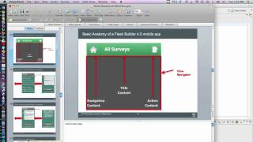
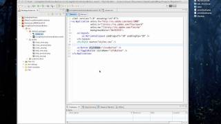
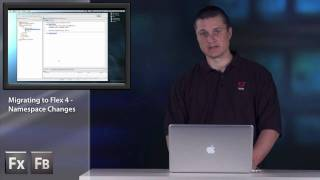
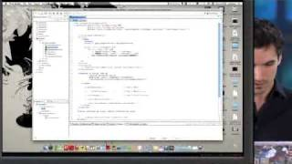
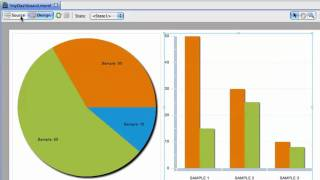
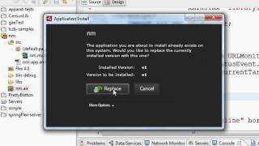
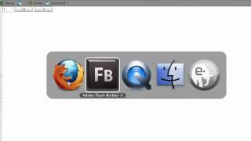

Title:  Getting Started Videos

Learn to use Apache Flex with the following video tutorials, created by our contributors and developers in Flex community.

Some of these videos were created for Adobe Flex, the predecessor to Apache Flex before it was donated to Apache. You may need to follow some additional steps in order to use some of the new features that Apache Flex provides. Find out more on the [Getting Started][1] page.  If you've made a video or tutorial that you would like featured here, let us know on the [mailing list][2].

<!--- start row -->

<h4>First Steps in Flex - ActionScript</h4>

James Ward shows the basics of using the ActionScript language with Flex. This is a complement of his book "First Steps in Flex".

<a href="https://www.youtube.com/watch?v=awz4_0M31oY&list=UU6tcGOzUVOGpUe-PFzpILmg&index=21" class="btn">Watch</a>

<h4>First Steps in Flex - Components</h4>

James Ward shows the basics of using Components with Flex. This is a complement of his book "First Steps in Flex".

<a href="https://www.youtube.com/watch?v=MNShGIsxM1g&list=UU6tcGOzUVOGpUe-PFzpILmg&index=19" class="btn">Watch</a>

<h4>Compiling the Apache Flex SDK with IntelliJ</h4>

Nicholas Kwiatkowski teaches how to compile the Apache Flex SDK and how to contibute back to the project. This video shows how to check out the code from the Apache SVN into IntelliJ, compile the entire project, and submit a patch back to fix a bug or close an issue

<a href="https://www.youtube.com/watch?v=5COE3hYqCJk" class="btn">Watch</a>

<h4>Apache Flex Development for Mobile Devices</h4>

A video course by Arthur Rosa, showing you everything you need to know to get up and running with Apache Flex development for mobile devices.

<a href="https://www.youtube.com/playlist?list=PL76B0B78D87EF65D4" class="btn">Watch</a>

<!-- start row -->

<h4>Adobe Flex Tutorials</h4>

Adobe Flex can be daunting. Luckily for you, Mike Lively and his team of NKU students are here to make things a bit easier for you.

<a href="https://www.youtube.com/playlist?list=PL7BA9C6B84482B980" class="btn">Watch</a>

<h4>Create Custom Skins for Mobile Apps</h4>

Piotr Walczyszyn walks you through how to create a custom SkinnableContainer Component for mobile applications using Flex and Flash Builder.

<a href="https://www.youtube.com/watch?v=WmKra-8srAg" class="btn">Watch</a>

<h4>Create ItemRenderers for Flex Mobile Projects</h4>

Piotr Walczyszyn explains the process of creating custom ItemRenderers in ActionScript3 for Flex mobile applications, as well as the functionality they add to your projects.

<a href="https://www.youtube.com/watch?v=EOpsDZaQrOI" class="btn">Watch</a>

<h4>Overview of Spark Formatters in Flex 4.5</h4>

In his continuing series on the new Spark components in Flex 4.5, James Ward demonstrates how the new Formatters simplify the process of displaying common data types as localized/internationalized and human friendly strings.

<a href="https://www.youtube.com/watch?v=pP4hxje6Sug" class="btn">Watch</a>

<!-- start row -->

<h4>Overview of Spark DataGrid in Flex 4.5</h4>

James Ward showcases the new DataGrid component in Flex 4.5, and explains how the new Spark architecture makes it easier than ever to customize and skin these components.

<a href="https://www.youtube.com/watch?v=vj6o0ToBkGA" class="btn">Watch</a>

<h4>Overview of Spark Forms in Flex 4.5</h4>

Join James Ward as he overviews the new Spark Form components in Flex 4.5, allowing you to provide dynamic, skinned data entry components in your Flex applications with very little work.

<a href="https://www.youtube.com/watch?v=TIcnvanEIJ0" class="btn">Watch</a>

<h4>Overview of Spark DataGrid in Flex 4.5 </h4>

Michael Chaize demonstrates how new features in Flex 4.5 make it easy to create multiple layouts for applications to run on mobile devices.

<a href="https://www.youtube.com/watch?v=qo0yPIAJmvk" class="btn">Watch</a>

<h4>Overview of Spark DataGrid in Flex 4.5</h4>

Michael Chaize demonstrates how new features in Flex 4.5 make it easy to create multiple layouts for applications to run on mobile devices.

<a href="https://www.youtube.com/watch?v=qo0yPIAJmvk" class="btn">Watch</a>

<!-- start row -->

<h4>Build iOS Applications using Flex and Flash Builder 4.5</h4>

Serge Jespers explains how you can build iOS applications using new capabilities in Flex and Flash Builder 4.5.

<a href="https://www.youtube.com/watch?v=e2_MyfmiUpM" class="btn">Watch</a>

<h4>Remote XML Services in Flex Mobile Applications</h4>

Join Duane Nickull as he builds a mobile application that binds to an XML Service using Flash Builder 4.5. Included are best architectural practices for manipulating and displaying the data.

<a href="https://www.youtube.com/watch?v=Cksp7IyVNk4" class="btn">Watch</a>

<h4>Layout Mirroring with Flex</h4>

Michael Chaize explains how layout mirroring helps minimize interface redesigns when porting a Flex application to languages with right-to-left text orientations.

<a href="https://www.youtube.com/watch?v=-_QXL5k4cUw" class="btn">Watch</a>

<h4>Migrating to Flex 4: Using Skins</h4>

Using skins can provide versatility and an ease to customizing components. Renaun Erickson shows how to create both an image-based Button and a ToggleButton through Flex 4 skinning.

<a href="https://www.youtube.com/watch?v=hjcAFuqPAGU" class="btn">Watch</a>

<!-- start row -->

<h4>Migrating to Flex 4: Embedding Fonts</h4>

Spark components by default use the new Text Layout Framework (TLF) engine and require CFF embedded fonts. Renaun Erickson demonstrates how to embed fonts for both TLF and non-TLF based components.

<a href="https://www.youtube.com/watch?v=_uzq1-tKJx0" class="btn">Watch</a>

<h4>Migrating to Flex 4: Containers</h4>

Renaun Erickson explores the Flex 4 container classes and component layouts of HBox, HGroup, SkinnableContainer and BorderContainer.

<a href="https://www.youtube.com/watch?v=ctjsRf3LJH4" class="btn">Watch</a>

<h4>Migrating to Flex 4: Namespace Changes</h4>

Join Renaun Erickson in his video series that offers tips on migrating to Flex 4. In this episode, learn about namespace changes to both MXML and CSS files, such as the former "mx" namespace is now "mx," "fx" and "s."

<a href="https://www.youtube.com/watch?v=mM2HQovyU0Y" class="btn">Watch</a>

<h4>Layouts in Flex 4</h4>

Join Michael Chaize as he examines the new component architecture in Flex 4. He highlights the ability to customize both the views and behaviors of objects in a project.

<a href="https://www.youtube.com/watch?v=ucRryIoS-Sk" class="btn">Watch</a>

<!-- start row -->

<h4>Build a Dashboard Application in Flex 4</h4>

Michael Chaize offers a step-by-step tutorial on building a dashboard application.  He walks you through a Flex 4 project created with the Flash Builder 4 IDE.

<a href="https://www.youtube.com/watch?v=13X0kC9vCgE" class="btn">Watch</a>

<h4>Build your First Desktop Application with Flash Builder</h4>

Follow along as James Ward shows you how to build your first desktop application using Flash Builder, Flex and AIR.

<a href="https://www.youtube.com/watch?v=IkWkZGLm-jo" class="btn">Watch</a>

<h4>Use the States Model in Flex 4</h4>

Serge Jespers builds a Flex 4 application with Flash Builder 4, highlighting the ability to customize components such as the states panel and tags, log-in screen and button, and click events.

<a href="https://www.youtube.com/watch?v=_nJYEKpm8QE" class="btn">Watch</a>

<h4>Styling Flex 4 Components with Flash Builder 4</h4>

Piotr Walczyszyn demonstrates the new theming capabilities in Flash Builder 4 and the new features of the CSS engine that come with Flex 4.

<a href="https://www.youtube.com/watch?v=Gt5HgpEVhLM" class="btn">Watch</a>

<!-- start row -->

<h4>Define Events in Flex 4 with Flash Builder 4</h4>

Mihai Corlan shows how to create components with Flash Builder 4 and ActionScript, and he simplifies how to customize an event dispatch in a Flex 4 project.

<a href="https://www.youtube.com/watch?v=gA3AyUu1MGE" class="btn">Watch</a>

<h4>The Graphics Package in Flex 4</h4>

Duane Nickull shows how to use the MXML syntax to create a rectangle using the new Spark graphic packages.

<a href="https://www.youtube.com/watch?v=KuNziTPiln0" class="btn">Watch</a>

<h4>Custom Layouts in Flex 4</h4>

Ryan Stewart discusses the new functionality of the next version of Flex, codename Gumbo, with Evtim Georgiev, an Engineer on the SDK team. A demo of Ryan creating a custom layout follows.

<a href="https://www.youtube.com/watch?v=kSLoYOKogqs" class="btn">Watch</a>

<h4> Blazing Fast Data Transfer in a Flex Application</h4>

James Ward demonstrates the benefits of using the AMF technology to quickly transfer data between the client and server.

<a href="https://www.youtube.com/watch?v=07ND5J0pi8U" class="btn">Watch</a>

 [1]:  doc-getstarted.html
 [2]:  community-mailinglists.html