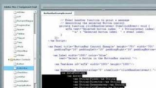

Title:  Getting Started Videos

Learn to use Apache Flex with the following video tutorials, created by our contributors and developers in Flex community.

Some of these videos were created for Adobe Flex, the predecessor to Apache Flex before it was donated to Apache. You may need to follow some additional steps in order to use some of the new features that Apache Flex provides. Find out more on the [Getting Started][1] page.  If you've made a video or tutorial that you would like featured here, let us know on the [mailing list][2].

<!--- start row -->

<h4>First Steps in Flex - ActionScript</h4>

James Ward shows the basics of using the ActionScript language with Flex. This is a complement of his book "First Steps in Flex".

<a href="https://www.youtube.com/watch?v=awz4_0M31oY&list=UU6tcGOzUVOGpUe-PFzpILmg&index=21" class="btn">Watch</a>

<h4>First Steps in Flex - Components</h4>

James Ward shows the basics of using Components with Flex. This is a complement of his book "First Steps in Flex".

<a href="https://www.youtube.com/watch?v=MNShGIsxM1g&list=UU6tcGOzUVOGpUe-PFzpILmg&index=19" class="btn">Watch</a>

<h4>Compiling the Apache Flex SDK with IntelliJ</h4>

Nicholas Kwiatkowski teaches how to compile the Apache Flex SDK and how to contibute back to the project. This video shows how to check out the code from the Apache SVN into IntelliJ, compile the entire project, and submit a patch back to fix a bug or close an issue

<a href="https://www.youtube.com/watch?v=5COE3hYqCJk" class="btn">Watch</a>

<h4>Apache Flex Development for Mobile Devices</h4>

A video course by Arthur Rosa, showing you everything you need to know to get up and running with Apache Flex development for mobile devices.

<a href="https://www.youtube.com/playlist?list=PL76B0B78D87EF65D4" class="btn">Watch</a>

<!-- start row -->

<h4>Adobe Flex Tutorials</h4>

Adobe Flex can be daunting. Luckily for you, Mike Lively and his team of NKU students are here to make things a bit easier for you.

<a href="https://www.youtube.com/playlist?list=PL7BA9C6B84482B980" class="btn">Watch</a>

 [1]:  doc-getstarted.html
 [2]:  community-mailinglists.html