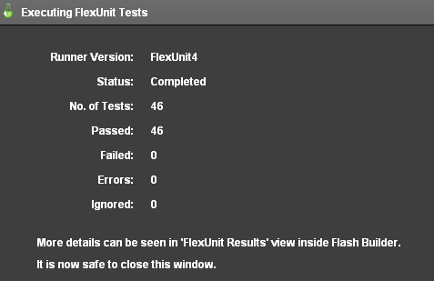
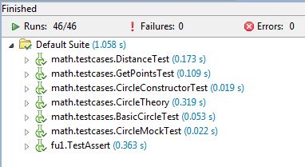

Title:  Unit 12 - Running Tests from Different Versions

<a href="../code/Unit12.zip"> Download Unit Project Files</a>

Throughout this course you have been introduced to new types of runners for FlexUnit 4. The first runner you used ran basic FlexUnit tests. The proper name for that runner is the BlockFlexUnit4Runner. Next you learned about the Suite runner and more recently the Theories and Parameterized runner.

This lesson introduces two additional runners, the runner for FlexUnit .9 tests and the runner for Fluint 1.x tests.

<h3>Objectives:</h3>

After completing this lesson, you should be able to:

<ul>
	<li>Create a mixed suite of FlexUnit .9 tests, Fluint 1 tests, and FlexUnit 4.x tests</li>
</ul>

<h3>Topics</h3>

In this unit, you will learn about the following topics:

<ul>
	<li>Running a FlexUnit .9 test</li>
	<li>Running a Fluint 1 test</li>
	<li>Understanding a runner</li>
	<li>Understanding how FlexUnit 4.x can work with multiple runners</li>
</ul>

<h2>Running a FlexUnit .9 test</h2>

<ul>
	<li>FlexUnit 4 includes the entire FlexUnit .9 framework</li>
	<li>You may not mix FlexUnit .9 and FlexUnit 4 style tests in the same test case,</li> 
	<li>FlexUnit .9 and FlexUnit 4 tests can exist in the same FlexUnit 4 suite</li>
</ul>

<h2>Running a Fluint 1 test</h2>

<ul>
	<li>FlexUnit 4 also includes the entire Fluint 1 framework</li>
	<li>Like FlexUnit .9, you may not mix Fluint 1 tests with FlexUnit 4 tests in the same test case</li>
	<li>Fluint 1 and FlexUnit 4 tests can exist in the same FlexUnit 4 suite</li>
</ul>

<h2>Understanding a runner</h2>

Runners are a major component of the extensibility layer of FlexUnit 4. They facilitate creating entirely new test types that can gain the benefit of FlexUnit 4.x integration without rewriting the entire code base.

A runner is just a class that implements an interface that FlexUnit 4 can understand.  FlexUnit 4 includes runners for FlexUnit .9, Fluint 1, FlexUnit 4, Suites, Theories, and Parameterized tests.

Runners operate through a token system. At the start of a test run, a runner is provided a token. To simplify things a bit, you can think of the token like the silver baton used in a relay race.  The system asks each runner in turn if it can handle the tests contained within an individual class. If the runner can, it passes a token to that runner which now becomes the active runner.
 

That runner in turn hands the token to any sub-runners as needed (think Suite which just contains classes to be run by other runners). Once the test completes it passes the token and result back to whomever provided it with the token. In this way, tests are recursively executed until the token makes it all the way back to the framework itself.

<h2>Understanding how FlexUnit 4.x can work with multiple runners</h2>

The token system within FlexUnit 4 allows the framework to understand different runners without knowing the actual implementation of the runners. As long a runner notifies FlexUnit 4 through the token that a test finished and what the result was the framework does not care how the runner made that decision.
  

The metadata decoration "RunWith" notifies FlexUnit 4 which runner to use for the tests contained in the class.  If no runner is specified FlexUnit 4 will attempt to derive the correct runner from a series of possibilities.
 

You can create new runners from scratch or extend existing runners to add functionality. The parameterized runner is an excellent example of adding additional functionality to the base runners used by FlexUnit.

<h2>Walkthrough 1: Creating a mixed Suite of Tests</h2>

In this walkthrough you will perform the following tasks:

<ul>
	<li>Run a FlexUnit 1 test case alongside FlexUnit 4 test cases and suites.</li> 
</ul>

<h3>Import a new test</h3>

<ol>
	<li>
		
Import the FlexUnit4Training_wt1.fxp project from the Unit 12/Start folder. Please refer to Unit 2: Walkthrough 1 for instructions on importing a Flash Builder project.

		<h3> Examining the FlexUnit .9 tests</h3>
	</li>
	<li>
		
Open the TestAssert.as file in the fu1 package in the tests folder.

		
As you examine the class file you will notice a few differences about these test methods. The <code>TestAssert</code> class extends from the <code>TestCase</code> class.  The TestCase class was the base class for all tests in FlexUnit .9.

<code><pre>public class TestAssert extends TestCase {      
      public function TestAssert( name : String = null ) {
         super( name );
      }
      ...
}</pre></code>

The class constructor in FlexUnit .9 can be used to provide a name for this test in certain circumstances. In this test it does nothing more than call its <code>super()</code> method. FlexUnit 4.x tests do not descend from any particular class.
 

Metadata is not used to distinguish tests and fixture from normal methods. Every method in this case prefixes the word <i>test</i> to its name. Take a look at the <code>testMatch()</code> method:

<code><pre>public function testMatch() : void {
	Assert.assertMatch(
	     /fr.*gt/,
	     "feeefrbgbgbggt" );
	Assert.assertMatch(
	     /.*@adobe\.com/,
	     "xagnetti@adobe.com" );
	Assert.assertMatch(
	     /.*@adobe.?com/,
	     "xagnetti@adobevcom" );
	try {
	   Assert.assertMatch(
	     /.*@adobe\.com/,
	     "xagnetti@adobevcom" );             
	}
	catch ( e : AssertionFailedError ) {
	   assertAssertionsHaveBeenMade( 4 );
	   return;
	}
	fail();
}</pre></code>
		
There are separate Assert classes in FlexUnit 4 and FlexUnit .9.  Both have static methods for making assertions. When running tests in FlexUnit 4 you can use either of these classes, to help maintain backwards compatibility.
 
		
FlexUnit 4.x Assert: <code>org.flexunit.Assert</code>

		
FlexUnit 1 Assert: <code>flexunit.framework.Assert</code>

		
For catching errors, FlexUnit 1 uses <code>try, catch</code> statements. FlexUnit 4.x uses <code>expects=""</code> metadata for the same kind of test.

		<h3> Run FlexUnit 1 tests</h3>
	</li>
	<li>
		
Open the FlexUnit4Training.mxml file.

	</li>
	<li>
		
Within the <code>&#60;fx:Script&#62;</code> block there is a function named <code>currentRunTestSuite()</code>. Add a line that calls the <code>testsToRun.push()</code> method with the argument <code>TestAssert</code>.
 

<code><pre>import fu1.TestAssert;
import math.testcases.CircleSuite;
public function currentRunTestSuite():Array {
	var testsToRun:Array = new Array();
	testsToRun.push( CircleSuite );
	testsToRun.push( TestAssert );
	return testsToRun;
}</pre></code>
		
If you did not use code-completion, add the import statement for fu1.TestAssert at this point.

	</li>
	<li>
		
Save and Run the FlexUnit4Training.mxml file.

		
If FlexUnit4Training.mxml ran successfully you should see the following output in your browser window:

		 
		
Figure 1: FlexUnit tests passed

		
And in the FlexUnit Results tab, you will see the results of all tests:

		 
		
Figure 2: FlexUnit results window

	</li>
</ol>

<h2>Summary</h2>

<ul>
	<li>
FlexUnit 4.x can run test cases from FlexUnit .9 and Fluint 1.x.
</li>
	<li>
Tests from legacy frameworks must be isolated to their own cases, because they must be run with their own runner.
</li>
	<li>
The results of tests from all cases are available in the Flash Builder FlexUnit Results tab.
</li>
</ul>

<h2>Navigation</h2>
<ul>
    <li><a href="Unit-11.html">Unit 11 - Parameterized Tests</a></li>
    <li><a href="Unit-13.html">Unit 13 - Working with Asynchronous Operations</a></li>
    <li><a href="../index.html">Table of Contents / Introduction</a></li>
</ul>
