Title:  Unit 16 - Allowing Your Tests to Function with Continuous Integration

<a href="../code/Unit16.zip"> Download Unit Project Files</a>

Continuous integration testing is another necessity of the complex application development environment. Generally, when many people and external forces interact with a deployed or actively developed application, quality control measures must be in place for the application's full functionality. Continuous integration systems should run application tests automatically, and some can be configured to do so.

<h3>Objectives:</h3>

After completing this lesson, you should be able to:

<ul>
	<li>Setup FlexUnit project builds with Apache Ant</li>
	<li>Run FlexUnit tests within the Hudson continuous integration environment</li>
</ul>

<h3>Topics</h3>

In this unit, you will learn about the following topics:

<ul>
	<li>Understanding continuous integration</li>
	<li>Examining a build script</li>
	<li>Hudson</li>
	<li>Understanding listeners</li>
	<li>Failure and Success reporting options</li>
</ul>

<h2>Understanding continuous integration</h2>

Continuous Integration is a software development practice where members of a development team integrate their source code changes frequently; typically each developer integrates their changes at least once per day. This practice leads to multiple integrations throughout the day and with every integration the changes are verified by an automated build (which includes testing) to detect integration errors as quickly as possible.
 

Many tools exist to support a CI environment and make the process automated. Some of the common ones include:

<ul>
	<li>Hudson</li>
	<li>Cruise Control</li>
	<li>Continuum</li>
</ul>

CI systems generally include a source repository, an automated build including build script, self testing code, joint commit by developers, an integration machine and, frequently, automated deployment.

CI builds commonly use the following process:

<ul>
	<li>Developers run local builds and tests on code changes.</li>
	<li>Developers check in code into the main repository.</li>
	<li>An automated build server monitors the repository.</li>
	<li>New code is checked into a project build and continuously integrated and tested.</li>
	<li>Test results are available to all developers on the project and reported in real time.</li>
</ul>

<h2>Understanding listeners</h2>

Listeners act as a communication between the test runners and a reporting device. If a runner acts as the worker, the listener acts as the foreman, reporting the results of the workers labors.

All listeners implement the IRunListener interface. FlexUnit 4 may use any number of listeners, each will be called as a test completes. It is also possibly to write custom listeners further extending the framework.

There are several base listeners included in FlexUnit.

<h3>UIListener</h3>

<ul>
	<li>A separate library which allows visual reporting of results</li>
	<li>Accepts user interaction</li>
	<li>Gives detailed information about test run times, passing, failing, ignores and failure messages</li>
</ul>

<h3>CIListener</h3>

<ul>
	<li>Separate library listener project</li>
	<li>Creates a socket connection to communicate results over a connection</li>
	<li>As part of CI, communicates and reports results to the FlexUnit Ant task</li>
</ul>

<h3>XMLListener</h3>

<ul> 
	<li>Creates an XML report for tests</li>
	<li>Primarily used by the Flashbuilder FlexUnit plugin</li>
	<li>Can be customized to report XML across different sockets</li>
</ul>

<h2>Walkthrough 1: Using the CIListener</h2>

In this walkthrough you will perform the following tasks:

<ul>
	<li>Edit the application to use the CIListener</li>
</ul>

<h3>Adding the CIListener</h3>

<ol>
	<li>
		
Import the FlexUnit4Training.fxp project from the Unit 16/Start folder. Please refer to Unit 2: Walkthrough 1 for instructions on importing a Flash Builder project.

	</li>
	<li>
		
Open the FlexUnit4Training.mxml file.

	</li>
	<li>
		
Find and remove the <code>FlexUnitTestRunnerUI</code> component with id <code>testRunner</code> from the application file.
  
		
You are removing this section of code as you will no longer be using the UIRunner.

		<s>&#60;flexui:FlexUnitTestRunnerUI id="testRunner"/&#62;</s>
		
Continuous integration servers are autonomous. In addition to creating unnecessary overhead, a UIRunner prevents FlexUnit from running in a headless environment.

	</li>
	<li>
		
Within the <code>&#60;fx:Script&#62;</code> block, there is a method named <code>onCreationComplete()</code>. Remove the body of this method, leaving just the empty shell of the method.

<code><pre>private function onCreationComplete():void {
}</pre></code>
	</li>
	<li>
		
Within the <code>&#60;fx:Script&#62;</code> block add a new public variable named <code>core</code> of type <code>FlexUnitCore</code>.
  
		<code><pre>public var core:FlexUnitCore;</pre></code>
		
If you did not use code-completion, add the import statement for and org.flexunit.runner.FlexUnitCore at this time.

		
The <code>core</code> acts as our runner; we will be adding the <code>CIListener</code> to the core listeners.

	</li>
	<li>
		
In the <code>onCreationComplete()</code> method instantiate the <code>core</code> variable to a new <code>FlexUnitCore()</code>. Call the <code>core.addListener()</code> method on the next line, passing it an argument of <code>new CIListener()</code>. On the next line call the <code>core.run( currentRunTestSuite() )</code>.
 
<code><pre>private function onCreationComplete():void {
	core = new FlexUnitCore();
	core.addListener( new CIListener() );
}</pre></code>
	</li>
	<li>
		
On the following line, call <code>core.run()</code> passing <code>currentRunTestSuite()</code> as its argument.
 
<code><pre>private function onCreationComplete():void {
	core = new FlexUnitCore();
	core.addListener( new CIListener() );
	core.run( currentRunTestSuite() );
}</pre></code>
		
If you did not use code-completion, add the import statement for org.flexunit.listeners.CIListener at this time.

	</li>
	<li>
		
Save this mxml file. Do not run it at this time.

	</li>
</ol>

<h2>Examining an Ant build script</h2>

A build script is an XML configuration file to run compiling and, in some cases, testing of the app. The build file acts as an instruction manual to the CI server on what files to include and what tests to run. It may also contain additional behaviors.

Scripts are made up of a project, optional properties, optional task definitions and a series of 'targets' which must include at least one default target.

<h3>Project tag</h3>

<ul>
	<li>Acts as the build header</li>
	<li>name - name of the project</li>
	<li>default - the default target, or command, to run when the build is run</li>
	<li>basedir - Base directory for all work. If none is specified, Ant uses the build file directory as base directory</li>
	<li>Project tag structure</li>
</ul>

<code><pre>&#60;project name=<i>"project_name"</i> basedir=<i>"project_base"</i> default=<i>"default_target"</i> &#62;</pre></code>

<h3>Property tag</h3>

<ul>
	<li>Frequently used to create shorthand variables for directory locations</li>
	<li>Also used to specify directories of task targets</li>
	<li>Property tag structure</li>
</ul>

<code><pre>&#60;property name=<i>"property_name"</i> location=<i>"property_location"</i> /&#62;</pre></code>

<h3>Taskdef tag</h3>

<ul>
	<li>Tasks define the custom behavior to be used with the build</li>
	<li>Frequently built into a jar file</li>
	<li>The taskdef tag defines the location of a task within the jar</li>
	<li>Task definition tag structure</li>
</ul>

<code><pre>&#60;taskdef resource=<i>"task_location_within_jar"</i> classpath=<i>"task_jar_location"</i> /&#62;</pre></code>

<h3>Target tag</h3>

<ul>
	<li>Creates possible start points for where the build should begin</li>
	<li>Targets may depend on other targets</li>
	<li>The compile target, common in most Flex builds, will depend on directory construction</li>
	<li>In the case of testing, the test target will depend on the application being compiled</li>
	<li>If a target has dependencies, the dependencies will be run when the target is run</li>
	<li>Target tag structure</li>
</ul>

<code><pre>&#60;target name=<i>"target_name"</i> depends=<i>"target_dependencies"</i>&#62;</pre></code>

<h3>Task</h3>

<ul>
	<li>Each task is a job or file to be run as part of the build</li>
	<li>A task is a custom piece of code to be executed during the build</li>
	<li>There are many common tasks included with Ant</li>
	<li>We are also concerned with the compile task, FlexUnit task and delete task</li>
	<li>Each task may have its own unique properties</li>
	<li>Common task tag structure</li>
</ul>

<code><pre>&#60;taskname id=<i>"task_id"</i> attribute1=<i>"..."</i> attribute2=<i>"..."</i> ... /&#62;</pre></code> 

<ul>
	<li>For building projects with Hudson we will be using 6 tasks, Flex Ant task, FlexUnit task, JUnit report task, copy task, zip task and delete task</li>
	<li>The flex ant task consists of the following tasks</li>
	<ul>
		<li>mxmlc - Application compiler for SWFs</li>
		<li>compc - Component compiler for SWFs and RSLs</li>
		<li>html-wrapper - Generates wrapper and supporting files</li>
		<li>asdoc - Generates ASDoc output</li>
	</ul>
	<li>The flexunit task which consists solely of the flexunit task</li>
	<li>The junitreport task, which allows viewing of JUnit style reports</li>
	<li>The delete task, which will be used as a clean target</li>
	<li>Copy task, for copying files</li>
	<li>Zip task, for zipping files</li>
</ul>

<h2>Hudson</h2>

A popular, open-source, continuous integration server, Hudson is simple to set up, configure and use. It can monitor multiple jobs, and through use of the FlexUnitAntTask, can make automating testing virtually a painless process.

In order to use Hudson, it requires that Ant and/or Maven be installed on the CI system. It may be deployed through the .war file to an Apache, Tomcat, Glassfish or other HTTP server project. Hudson may also be used by way of the Windows service on a Windows machine, or integrated directly with many Linux distributions.

For more information about Hudson and its capabilities, visit:

<a class='contentlink' href='https://hudson-ci.org' target='blank'>https://hudson-ci.org</a>

<h2>Failure and Success reporting options</h2>

The FlexUnit Ant Task allows several options for test reporting

<ul>
	<li>
haltonfailure=true|false
</li>
	<ul>
		<li>
If true, when a failure or error is encountered will complete all currently executing tests then cancel the run
</li>
	</ul>
	<li>
verbose=true|false
</li>
	<ul>
		<li>
If true, reports the complete failure message for each failed test
</li>
		<li>
If false, reports number of tests passed and failed only
</li>
	</ul>
	<li>
port=&#60;port results will be reported on, default is CIListener port&#62;
</li>
	<li>
timeout=&#60;length of time to wait for runner to send results before considering test a failure&#62;
</li>
	<li>
failureproperty=&#60;property name to set to <code>true</code> if any tests fail&#62;
</li>
</ul>

<h2>Walkthrough 2: Running your tests from Hudson test launch</h2>

In this walkthrough you will perform the following tasks:

<ul>
	<li>Prepare a debug projector</li>
	<li>Prepare an Ant build file</li>
	<li>Install Ant and Hudson</li>
	<li>Setup your environment to run tests from Hudson</li>
</ul>

<h3>Import the CI Project</h3>

<ol>
	<li>
		
Import the FlexUnitTraining_wt2.fxp contained in Unit 16/Start folder.

		
Please refer to Unit 2: Walkthrough 1 for instructions on importing a Flash Builder project.

		<h3> Preparing the debug projector</h3>
	</li>
	<li>
		
Navigate to Unit 16/FlexUnitCI and find the file flashplayer_sa_win.exe (Windows users) or flashplayer_10_sa_debug.app.zip (Mac users). This is the debug version of the standalone FlashPlayer. Copy it to your local file system somewhere you will remember.
  
		
In this walkthrough, you will associate swf files with the standalone, debug player. Failure to associate SWF files with a standalone FP will cause Ant builds to fail. This requires administrator privileges.

	</li>
	<li>
		
Windows Users: Return to the FlexUnitCI folder. Right-click on the TestSwf.swf and select <b>Open with...</b>. If an expanding menu appears, instead click <b>choose program</b>. This should open the following screen:

		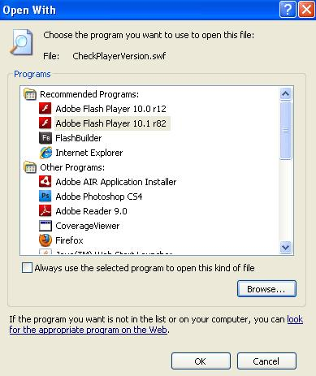
		
Depending on your version, the dialog may appear slightly different.  Click on <b>Browse...</b> and select the standalone player you saved earlier.  Click OK.  The file will attempt to open and throw a SecurityError. This is normal. Click Dismiss and close the player.

		
Mac Users: Return to the FlexUnitCI folder. Right-click, or if using a single mouse button control-click, on the file <b>TestSwf.swf</b> and select <b>Get Info</b>. In this dialogue you will see a section titled <b>Open With</b>.

		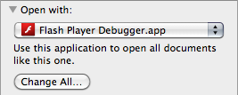 
		
Select the drop down menu and click <b>Other...</b> When the browser box opens, navigate to the location you saved the debug player and select that file.

		<h3> Prepare the Ant build file</h3>
		
Continuous integration projects require a build file.  Since you will be using Ant along with Hudson, you need a build.xml file.

	</li>
	<li>
		
Open the build.xml.
  
		
You will need to make some modifications to this file for it to work with your project build. You will see a heading that reads: <b>Setup paths for build</b>.
  
		
If you changed the organization of your project, make sure these paths reflect those changes.

		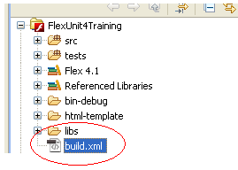
		
You will also see a heading <code>&#60;!--Setup Flex and FlexUnit ant tasks --&#62;</code>.  Here you will need to modify the path locations of your tasks as well as set the <code>FLEX_HOME</code>.

	</li>
	<li>
		
First, navigate to your Flex SDK. In most cases, your Flex SDK should be located at root/Program Files/Adobe/Adobe Flash Builder 4/sdks.
 
		<code><pre>&#60;property name="FLEX_HOME" 
 location="rootpath:/Program Files/Adobe/Adobe Flash Builder 4/sdks/4.1.0/" /&#62;</pre></code>
		
It is highly recommended you use Flex 4.1 SDK. Keep every directory in this walkthrough relative to the FLEX_HOME directory, this way the build file is guaranteed to reference these correctly.

		<h3> Install Ant and Hudson</h3>
	</li>
	<li>
		
Navigate to Unit 16/FlexUnitCI.  Copy this entire directory to the root drive.
  
		
You may copy it to another location; however this guide assumes you have copied it to this location. If you do not, be sure to adjust all directory references to your installed location.

	</li>
	<li>
		
Navigate to the URL:  <a class='contentlink' href='https://hudson.dev.java.net/hudson.jnlp' target='_blank'>https://hudson.dev.java.net/hudson.jnlp</a>

	</li>
	<li>
		
Choose to download and run the hudson.jnlp file.

		
After the Java Web Start has completed you should see a startup dialog:

		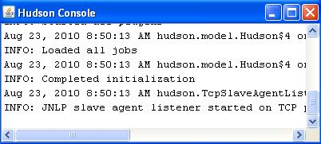
		
This is the Hudson test drive. For our purposes this is sufficient. However, if you are running Hudson through your CI machine you will want to install the windows service or console app depending on your OS.

	</li>
	<li>
		
Open your browser and navigate to the <a class='contentlink' href='http://localhost:8080/' target='_blank'>http://localhost:8080/</a>

		
You should see the Hudson start page.
		
	</li>
	<li>
		
On the left is a menu of options. Click on <b>Manage Hudson</b> and navigate to <b>Configure System</b>. Here, you will need to specify the Ant location.

	</li>
	<li>
		
Go to the sub heading <b>Ant</b> and click the <b>Add Ant</b> button.  For the name, specify 'FlexUnit Intro Ant'. Uncheck <b>Install automatically.</b>

	</li>
	<li>
		
In the <b>ANT_HOME</b> field, specify the install directory of your Ant installation. If you used the walkthroughs location, specify 'root/FlexUnitCI/Ant'.

		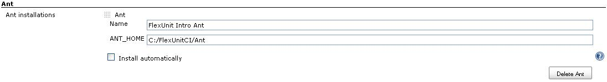
	</li>
	<li>
		
Navigate to the bottom of the page and click <b>Save</b>.

	</li>
	<li>
		
On the left hand menu, click <b>New Job</b>.

	</li>
	<li>
		
Give the job a name of FlexUnitCI Intro. Select <b>Build a free-style software project</b>. This version will allow you to build directly from an Ant script.

		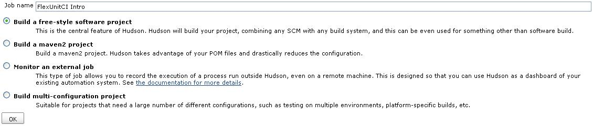
		
You will now see the new project page. You may at this time assign a description to the project. Take note of the Source Code Management settings.  The SCM is what will turn our build into a continually integrating project.  Normally we would specify our SCM and pass the location of the SCM. Hudson would then be pushed any changes to the repository and immediately execute a build. However, since we do not have any SCM for this project we will be executing manual builds.

	</li>
	<li>
		
Leave this option as <b>None</b>.

		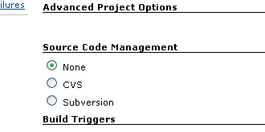
	</li>
	<li>
		
Under the heading <b>Build</b>, add a new build step. Click on the drop down and select <b>Invoke Ant</b>. For the <b>Ant Version</b> select the <b>FlexUnit Intro Ant</b>.  Under <b>Targets</b> enter 'test'. This will cause Hudson to run the test target every time a build is run.

	</li>
	<li>
		
Click <b>Save</b>.

	</li>
	<li>
		
You should now be taken to the project homepage. Right now this project will do nothing. You need to specify a workspace.  To do so, select <b>Workspace</b> from the main screen. This can also be accessed from the menu on the left.

		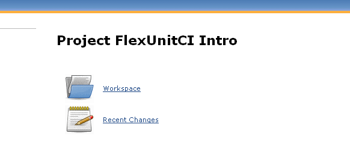 
		
You will receive an error:

		
		
This is completely expected. Hudson needs to execute a new build to configure the workspace.

	</li>
	<li>
		
Select <b>Run a build</b>.
  
		
You should see new Build History menu on the left, it will update with the new build.  At completion, this build should fail (red dot indicates failure). The build will fail because the current target does not exist. However, the workspace setup is now complete.

	</li>
	<li>
		
Click on the workspace link in the left-hand menu again.

		
You should now see:

		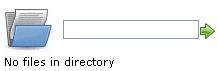 
		
Hudson is expecting the base directory of your project which should also contain the build.xml. Unfortunately, since we are not using a SCM, this directory will not populate correctly. We need to add the files directly to the workspace.

	</li>
	<li>
		
<i>Windows</i>: Navigate to: C:/Documents and Settings/&#60;username&#62;/.hudson/jobs/FlexUnitCI Intro/workspace
  
		
<i>Mac</i>: Navigate to: Users/&#60;username&#62;/.hudson/jobs/FlexUnitCI Intro/workspace

	</li>
	<li>
		
This is the default location of the test launch workspace. Copy <b>all</b> files contained within the FlexUnit4Training project directory into this directory.

	</li>
	<li>
		
Refresh the Hudson page in your browser.

	</li>
	<li>
		
Hudson should now show the current contents of your project.

		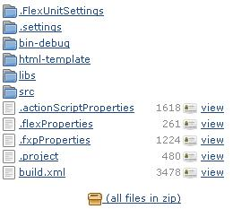 
		
The project is now ready to be built. Since we are running this from the Test Launch and do not have a SCM specified, we will need to run manual builds.

	</li>
	<li>
		
Select <b>Build Now</b> from the menu on the left.
  
		
Build now will force an immediate build on any files currently in the workspace.  This should return a success (blue dot on the left under build history.)
 
		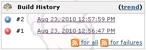
		
During test execution, you will see the standalone player load with a blank screen. This is normal and will close automatically. Do not close this manually or your build may fail.

	</li>
	<li>
		
Click on <b>build #2</b>.
 
		
This is the details view of the build. Since we have verbose set to true in the build file, we can view the details of each run.

	</li>
	<li>
		
Click on <b>Console Output</b>. Here will print detail of each test. Failures will also appear here.

		
Since JUnit reports were created for the test run, you may also view these.

	</li>
	<li>
		
Click on <b>Back to Project</b> in the left hand menu. Then click on <b>Workspace</b>. This will open the current workspace setup. Click on target then report then html. Select index.html to see the detailed JUnit report.

	</li>
	<li>
		
Congratulations, you have now completed your first Hudson test run.

		
Hudson will not auto build when new changes are made to the main project.  Because we had to copy the build files manually any new changes will also need to be manually copied. This is not necessary in a server version where a SCM tool has been specified for the project. Hudson will pull any new changes and create a new build automatically.

	</li>
</ol>

<h2>Navigation</h2>
<ul>
    <li><a href="Unit-15.html">Unit 15 - Creating Testable Code</a></li>
    <li><a href="../index.html">Table of Contents / Introduction</a></li>
</ul>
