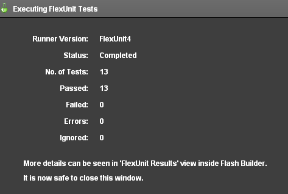

Title:  Unit 9 - External Data

<a href="../code/Unit9.zip"> Download Unit Project Files</a>

<p>For the sake of optimization or integration, large or complicated sets of data are often easier to manage within external files. FlexUnit 4.x provides support for external data in Theories as well as Parameterized tests, which you will learn to use in Unit 11.</p>
 
<h3>Objectives:</h3>

<p>After completing this lesson, you should be able to:</p>
<ul>
	<li>Load external data points from an XML file into the FlexUnit testing environment</li>
</ul>

<h3>Topics</h3>

<p>In this unit, you will learn about the following topics:</p>
<ul>
	<li>Understanding asynchronous loading</li>
	<li>Loading external data</li>
	<li>Discussion on data typing and conversion</li>
</ul>

<h2>Understanding asynchronous loading</h2>

<p>The large collections of data points that accompany theories can become increasingly difficult to maintain as the number of tests in your system grows. Additionally, in some circumstances, you may want to generate the data used for your data points in a different application or system.</p>
<p>In these cases, you will want to switch to external data. External data has the advantage of being maintained external to the tests, making maintenance easier and increasing the legibility of test cases.</p> 
<p>However, external data presents a particular problem in Flash-based testing. Flash is a single-threaded machine that uses asynchronous communication for all remote data access. It does not have the ability to access data synchronously nor the ability to suspend a process until data arrives.</p>
<p>This means the test runners will need to wait for a server response before parsing the returned data into datapoints before beginning the test process.</p>  
<p>While you could load all of the data for your system external to the testing framework before testing ever begins, you now lose some of the flexibility, or at least the performance, inherent in the ability to pick and choose test cases or suites and only load the data that is required.</p>
<p>To resolve these issues, FlexUnit 4 offers the concept of External Dependency Loaders. An External Dependency Loader allows the loading of external data in a test.</p>

<h2>Loading external data</h2>

<p>As every source of data for every user of FlexUnit is slightly different, you are required to write a simple class that understands how to load and parse your test data. This class implements the IExternalDependencyLoader interface and is used to load all data into FlexUnit.</p> 
<p>This interface has one required method: retrieveDependency(). This method returns an ExternalDependencyToken. During startup of the testing process, FlexUnit looks for IExternalDependencyLoaders and invokes this method.</p> 
<p>Internal to this method, you are responsible for making any server calls and loading any data. Once the operation has been completed, in either a result or fault, you are responsible for notifying the framework that it is now safe to begin testing.</p>
<p>Here is an example of the retreiveDependency function and the associated result and fault handlers that uses an HTTPService to retrieve data:</p>

```
public function RadiiDataHelper( url:String ) {
	service = new HTTPService();
	service.url = url;
	service.resultFormat = "e4x";

	dToken = new ExternalDependencyToken();
}

public function retrieveDependency( testClass:Class ):ExternalDependencyToken {
	var asyncToken:AsyncToken = service.send();
	asyncToken.addResponder( this );

	return dToken;
}

public function result( data:Object ):void {
	var ar:Array = new Array();
			
	var list:XMLList = data.result..node;
	var node:XML;
			
	for ( var i:int = 0; i &#60; list.length(); i++ ) {
		node = list[ i ][ 0 ];
		ar.push( Number( node.text() ) );
	}
			
	dToken.notifyResult( ar );
}

public function fault(info:Object):void {
	dToken.notifyFault( "Totally broken" );
}
```

<p>In this loader:</p>
<ol>
	<li><p>Loader is instantiated with a new HTTPService.</p></li>
	<li><p>retrieveDependency() makes the external HTTP call, returning the loaders ExternalDependencyToken.</p></li>
	<li><p>If the call is successful, the result function parses the data into an array (datapoints expect an array) and calls notifyResult() on the ExternalDependencyToken passing the datapoint array.</p></li>
	<li><p>If the call fails, the fault function calls notifyFault() on the token, passing a useful error message.</p></li>
	<li><p>If neither notifyResult() nor notifyFault() are called on the token the runner will stall indefinitely as it is impossible for the testing framework to identify a reasonable delay for your situation. This makes it extremely important to handle both cases.</p></li>
</ol>

<p>To use an external loader you must instantiate the loader and assign it to a public static variable in the test case. Constructor args are used to provide any additional configuration information to the loader.</p>

```
public static var testLoader:IExternalDependencyLoader = new MyLoader(" myData.xml" );
```

<p>You then need to create the datapoints array. However, instead of instantiating the array, as you had in previous lessons, you will specify a loader argument on the DataPoints metadata tag. The runner knows how to handle this attribute and ensure your loader is invoked.</p>

```
[DataPoints(loader="testLoader")]
[ArrayElementType("Number")]
public static var radii:Array;
```

<p>Once the data points are loaded, your test case will use them as if they were statically coded into the test case.</p>

<h2>Walkthrough 1: Moving Theory Data to an External Source</h2>

<p>In this walkthrough you will perform the following tasks:</p>
<ul>
	<li>Load radii data points from an external source.</li>
</ul>

<h3>Load the external data</h3>

<ol>
	<li>
		<p>Import the FlexUnit4Training_wt1.fxp project from the Unit 9/Start folder. If you completed the previous walkthrough, choose the option to Overwrite your existing project. If this is your first Flex Unit 4 Training walkthrough, import it as a new project.  Please refer to Unit 2: Walkthrough 1 for instructions on importing a Flash Builder project.</p>
		<p>The new FlexUnit4Training_wt1 project contains everything that all the walkthroughs up until this point have taken you through.It also includes several new files and additional dependencies to help you through the current walkthrough.</p>
	</li>
	<li>
		<p>Open the CircleTheory.as file in the math.testcases package within the tests directory.</p>
	</li>
	<li>
		<p>Add a public static variable named <code>radiiLoader</code> of type <code>RadiiDataHelper</code> to the CircleTheory class. It should instantiate a <code>RadiiDataHelper</code> object with the argument <code>"xml/radii.xml"</code>.</p>

```
public static var radiiLoader:RadiiDataHelper 
	= new  RadiiDataHelper( "xml/radii.xml" );
```

<p>If you did not use code-completion, add the import for helper.RadiiDataHelper at this time. RadiiDataHelper is the external loader and already has the logic for loading the data.</p>
		<h3><br />Alter the array to use the external data</h3>
		<p>Now that you are loading the radii data from an external source the <code>radii</code> variable no longer requires the static values. The <code>radii</code> variable must also be marked with <code>[DataPoints(loader="radiiLoader")] metadata</code>.</p>
	</li>
	<li>
		<p>Modify the radii array so that it has <code>[DataPoints(loader="radiiLoader")]</code> metadata.</p>

```
[DataPoints]
[ArrayElementType("Number")]
public static var radii:Array = [ -5, 1,2,3,4,5,6,7,8,9,10 ];
```

<p>Becomes:</p>

```
[DataPoints(loader="radiiLoader")]
[ArrayElementType("Number")]
public static var radii:Array;
```

</li>
	<li>
		<p>Save CircleTheory.as.</p>
		<h3><br />Examing the loader class</h3>
	</li>
	<li>
		<p>Open the RadiiDataHelper.as file in the helper package within the tests directory.</p>
		<p>To get an idea of how the loader class retrieves the data, you are going to setup breakpoints in the RadiiDataHelper class. As a result, you will get a chance to examine the data before it is parsed into the theory.</p>
	</li>
	<li>
		<p>In Flash Builder add a breakpoint within the RadiiDataHelper constructor at the line that reads: <code>dToken = new ExternalDependencyToken();</code></p>
		 
		<p class='caption' id='shift'>Figure 1: Adding a breakpoint to the constructor</p>
	</li>
	<li>
		<p>Add another breakpoint within the <code>retrieveDependency()</code> method at the line that reads <code>var asyncToken:AsyncToken = service.send();</code></p>
		 
		<p class='caption' id='shift'>Figure 2: Adding a breakpoint to the retrieveDependency() method</p>
	</li>
	<li>
		<p>Add a breakpoint within the <code>fault()</code> method at the line that reads: <code>dToken.notifyFault( "Totally Broken" );</code></p>
		
		<p class='caption' id='shift'>Figure 3: Adding a breakpoint to the fault() method,</p>
		<p>Ideally, you shouldn't hit the breakpoint within the <code>fault()</code> method, but if the loader has a problem retrieving the data, you will know before the tests are even run.</p>
	</li>
	<li>
		<p>Finally, add a breakpoint within the <code>result()</code> method at the line that reads: <code>dToken.notifyResult( ar );</code></p>
		 
		<p class='caption' id='shift'>Figure 4: Adding a breakpoint within the <code>result()</code> method</p>
	</li>
	<li>
		<p>Switch Flash Builder over to debug view using the selector in the upper-right-hand corner.</p>
		
		<p class='caption' id='shift'>Figure 5: Flash Debug view</p>
	</li>
	<li>
		<p>In the expressions tab, which should appear in the upper-right-hand corner by default, add a new watch expression by right-clicking on the whitespace.</p>
		
		<p class='caption' id='shift'>Figure 6: Adding a watch expression</p>
	</li>
	<li>
		<p>The expression being watched should be list, which is the returned data converted to an XMLList object.</p>
		
		<p class='caption' id='shift'>Figure 7: New watch expression</p>
	</li>
	<li>
		<p>Add another watch expression for the <code>ar</code> variable, which is the parsed array that the <code>RadiiDataHelper</code> returns as data points.</p>
	</li>
	<li>
		<p>Run the FlexUnit4Training.mxml file in debug mode.</p>
	</li>
</ol>

<p>If the FlexUnit4Training.mxml file runs successfully, it should take you through each breakpoint except for the one placed in the <code>fault()</code> method.</p>
<p>When you reach a breakpoint, press F8 or the play button to move on.</p>
<p>The first breakpoint illustrates the instantiation of the ExternalDependencyToken, which is responsible for notifying FlexUnit whether the data is return or there is a fault.</p>
<p>The next breakpoint illustrates the sending of the HTTPService.</p> 
<p>When you reach the third breakpoint, on the <code>dToken.notifyResult( ar );</code> line, the list watch expression should show that list is equal to an XMLList whose values can be expanded and evaluated in the Expressions tab.</p>


<p class='caption'>Figure 8: The list expression in the Expressions tab</p>

<p>The ar expression is the parsed array created in the <code>result()</code> method from the <code>XMLList</code>.</p>


<p class='caption'>Figure 9: The ar expression in the Expressions tab</p>

<p>After running through the last breakpoint, you should see the following in your browser window.</p>

 
<p class='caption'>Figure 10: FlexUnit tests passed</p>

<p>The radii.xml file contains the same values previously declared within the radii array. There is no change in operation, because the externally loaded values are interacting with the test in the same way, but having the data externalized makes it easy to modify the tests to run with different values, without having to re-compile the tests.</p>

<h2>Summary</h2>

<ul>
	<li><p>Loading external data is an inherently asynchronous process.</p></li>
	<li><p>For external data to be passed in as DataPoints, the data must be loaded with a loader class.</p></li> 
	<li><p>Loader methods, datapoints, and datapoint collections must be declared as static variables.</p></li>
</ul>

<h2>Navigation</h2>
<ul>
    <li><a href="Unit-8.html">Unit 8 - FlexUnit Theories</a></li>
    <li><a href="Unit-10.html">Unit 10 - Mock Classes</a></li>
    <li><a href="../index.html">Table of Contents / Introduction</a></li>
</ul>