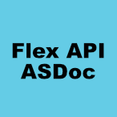

title:  Home Page
homepage:    true

<!-- Learn Flex Start -->

<h4>Learn Flex®:</h4>

<!-- start row -->

<!-- Project -->

    
<a href="https://flex.apache.org/doc-getstarted.html">

</a>

    

        <h5><a href="https://flex.apache.org/doc-getstarted.html">Getting Started With Flex</a></h5>
        
A quick introduction to Apache Flex that teaches you how to download the SDK, set up your IDE or editor, and create your first "Hello World" application.

    

<!-- Project -->

    
<a href="https://flex.apache.org/asdoc/">

</a>

    

        <h5><a href="https://flex.apache.org/asdoc/">Flex API ASDoc Reference</a></h5>
        
A full listing of all classes, interfaces, methods, properties, events, styles, and effects available in Apache Flex. Includes user interface components, skins, networking services, formatters and validators, and other utilities.

    

<!-- Project -->

    
<a href="https://flex.apache.org/doc-videos.html">

</a>

    

        <h5><a href="https://flex.apache.org/doc-videos.html">Video Tutorials</a></h5>
        
Learn to create Flex applications and components with helpful video tutorials that walk you through the process. Discover a variety of videos created both by contributors to the project and by developers using Flex for real-world projects.

    

<!-- Project -->

    
<a href="https://flex.apache.org/flexunit/tutorial/">

</a>

    

        <h5><a href="https://flex.apache.org/flexunit/tutorial/">Apache FlexUnit Tutorial</a></h5>
        
Learn to write unit tests with Apache FlexUnit. Includes an overview of key FlexUnit and unit testing concepts, demonstrations and walkthroughs that illustrate and guide you through the process of writing tests and running them, and a summaries and reviews of all concepts covered in the tutorial.

    

<!-- start row -->

<!-- Project -->

    
<a href="https://www.slideshare.net/bigosmallm/flexjs-an-introduction">

</a>

    

        <h5><a href="https://www.slideshare.net/bigosmallm/flexjs-an-introduction">FlexJS - An Introduction</a></h5>
        
FlexJS™ is a new application development framework that cross compiles MXML and ActionScript into HTML and JavaScript. It runs in web, desktop and mobile(app) in swf format and 
		runs in browser based environments as HTML/JS/CSS files without the need for the Flash Player plugin. It brings the advantages of Flex to the JavaScript world.

    

<!-- Project -->

    
<a href="https://www.adobe.com/devnet/flex/articles/interactive_maps.html">

</a>

    

        <h5><a href="https://web.archive.org/web/20160314204607/https://www.adobe.com/devnet/flex/articles/interactive_maps.html">Building interactive maps with Flex</a></h5>
        
It has never been easier to build interactive online maps with Flex. There is a wide range of APIs now available. The focus of this article is building a simple map application using the open-source Modest Maps Flex API. Modest Maps offers a number of advantages over other Flex mapping APIs including the ability to point at multiple basemap providers and direct access to the source code. 

    

<!-- start row -->

<!-- Learn Flex End -->
<!-- News Start -->

<h4>Latest News:</h4>

<strong>22</strong> <small>Nov. 2017</small>

<h4><a href="https://blogs.apache.org/flex/entry/apache-flex-4-16-1"><u>Apache Flex SDK 4.16.1 Released</u></a></h4>

Apache Flex SDK 4.16.1 has been released, which adds support for the latest Flash Player and AIR runtimes and some bug fixes. <a href="/installer.html">Install</a> it now, or <a href="https://blogs.apache.org/flex/entry/apache-flex-4-16-1">Read More Here</a>

<strong>12</strong> <small>Mar. 2017</small>

<h4><a href="https://blogs.apache.org/flex/entry/apache-flex-4-16-0"><u>Apache Flex SDK 4.16.0 Released</u></a></h4>

Apache Flex SDK 4.16.0 has been released, which adds support for the latest Flash Player and AIR runtimes, fixes nearly 40 bugs, and adds support for FontAwesome 4.7. <a href="/installer.html">Install</a> it now, or <a href="https://blogs.apache.org/flex/entry/apache-flex-4-16-0">Read More Here</a>

<strong>11</strong> <small>Apr. 2016</small>

<h4><a href="https://blogs.apache.org/flex/entry/apache_flexjs_0_6_0"><u>Apache FlexJS & FalconJX 0.6.0 Released</u></a></h4>

Apache FlexJS 0.6.0 and Apache Flex FalconJX 0.6.0 were released.  These tools allow ActionScript and Flex developers to create HTML based applications outputting to JavaScript. <a href="https:///installer.html">Install</a> it now, or <a href="https://blogs.apache.org/flex/entry/apache_flexjs_0_6_0">Read More Here</a>

<strong>11</strong> <small>Jan. 2016</small>

<h4><a href="https://blogs.apache.org/flex/entry/apache_flex_4_15_released"><u>Apache Flex 4.15 Released</u></a></h4>

Apache Flex 4.15 was released, which adds support for the latest Flash Player and AIR Runtimes, fixes several bugs and improves speed.  <a href="/installer.html">Install</a> it now, or <a href="https://blogs.apache.org/flex/entry/apache_flex_4_15_released">Read More Here</a>

<strong>11</strong> <small>Nov. 2015</small>

<h4><a href="https://blogs.apache.org/flex/entry/apache_flexjs_0_5_0"><u>Apache FlexJS 0.50 Released</u></a></h4>

Apache FlexJS 0.50  This release includes some new components, updated integration with Apache Cordova, a few effect classes, and drag and drop support. <a href="/installer.html">Install</a> it now, or <a href="https://blogs.apache.org/flex/entry/apache_flexjs_0_5_0">Read More Here</a>

<strong>31</strong> <small>Mar. 2015</small>

<h4><a href="https://blogs.apache.org/flex/entry/apache_flex_4_14_1"><u>Apache Flex 4.14.1 Released</u></a></h4>

Apache Flex 4.14.1 was released, which corrects over dozen bugs and adds new, minor features.  <a href="/installer.html">Install</a> it now, or <a href="https://blogs.apache.org/flex/entry/apache_flex_4_14_1">Read More Here</a>

<strong>3</strong> <small>Jan. 2015</small>

<h4><a href="https://blogs.apache.org/flex/entry/apache_flex_4_14_released"><u>Apache Flex 4.14 Released</u></a></h4>

Apache Flex 4.14.0 was released, and adds support for the latest Flash Player and AIR runtimes, promises, native support for tables in TLF, the Spark RichTextEditor component, FlatSpark skins and components, and iOS7 and Android 4.x mobile themes. <a href="/installer.html">Install</a> it now, or <a href="https://blogs.apache.org/flex/entry/apache_flex_4_14_released">Read More Here</a>

<strong>3</strong> <small>Jul. 2014</small>

<h4><a href="https://blogs.apache.org/flex/entry/apache_flex_sdk_4_13"><u>Apache Flex 4.13 Released</u></a></h4>

Apache Flex 4.13.0 was released, and adds support for the latest Flash Player and AIR runtimes, debugger support for ActionScript Workers, and over 30 bug fixes. <a href="/installer.html">Install</a> it now, or <a href="https://blogs.apache.org/flex/entry/apache_flex_sdk_4_13">Read More Here</a>

<!-- News  End -->
